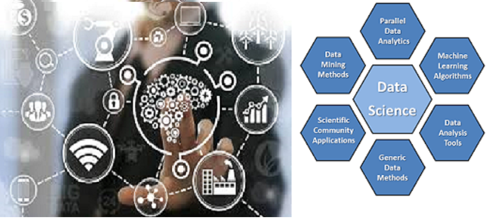
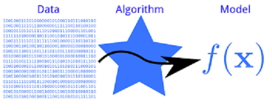

# MachineLearningforDataAnalysis

__Machine Learning (ML) and the Data Science are the buzzword in tchnology world.__ 

## Machine Learning
As per Arthur Samuel (1959), Machine Learning field of study that gives compiter the ability to learn without beling ecplicitly programmed.
is the science of creating algorithms and program which learn on their own. Once designed, they do not need a human to become better.

## Data Analysis
Data analysis is a process of inspecting, cleansing, transforming, and modeling data with the goal of discovering useful information, informing conclusions, and supporting decision-making. Data analysis has multiple facets and approaches, encompassing diverse techniques under a variety of names.In today's business world, data analysis plays a role in making decisions more scientific and helping businesses operate more effectively.
Data analysis is the act of getting useful insights/decisions out of data. 

__Machine learning is a method of data analysis that automates analytical model building.__

